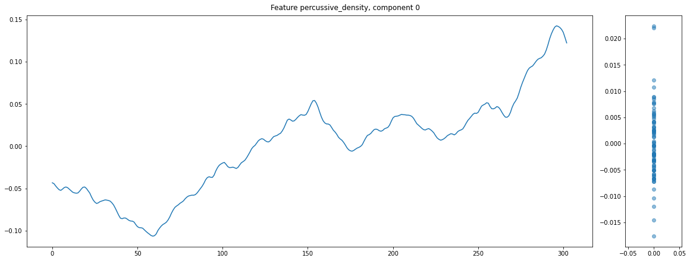
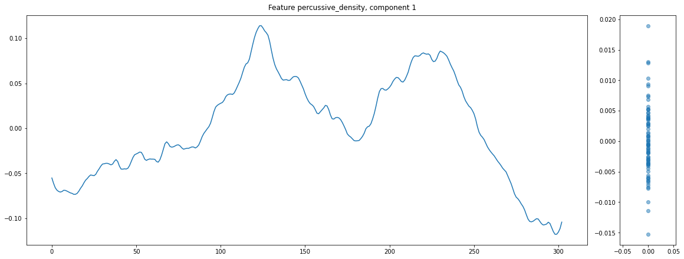
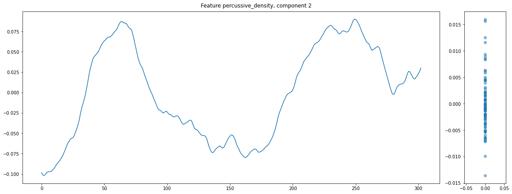

# DJ mix story arcs

This repository is a work in progress. It explores the following idea: do DJ mixes tell a story?

In their paper on "The emotional arcs of stories are dominated by six basic shapes", [Andrew Reagan et al.](https://epjdatascience.springeropen.com/articles/10.1140/epjds/s13688-016-0093-1) analyze the emotional arcs of a large corpus of stories.
This repository takes some ideas from that paper and tries to apply them to DJ mixes.
The intention is that this hopefully uncovers some latent structure in DJ mixes.

## How to use this repository

First, gather a collection of some DJ mixes. For example, I downloaded some (about 80) mixes from [this playlist of drum and bass mixes](https://soundcloud.com/fabric/sets/drum-bass).  

Make sure all mixes are converted to .wav files at a sample rate of 44100 kHZ. This makes the mix feature analysis script (see below) run much faster (librosa is slow at changing the sample rate when loading files):
```
for f in *.mp3; do ffmpeg -i "$f" -acodec pcm_u8 -ac 1 -ar 44100 "${f%.mp3}.wav" -y; done
```

Then, run the `dj_mix_analyser.py` script: 
```
python dj_mix_analyser.py -i ../path/to/your/mixes/in/wav/format -o output/
```
This calculates some features of the DJ mixes and stores them as `.npyz` archives.
The features used in this demo are quite simple: first, harmonic-percussive sound separation (HPSS) is performed on the spectrogram of the target mix.
Then, for slices of the (separated) spectrograms of a few seconds long, it is calculated how "dense" the harmonic part is, as well as how dense the percussive part is.
This gives some measure of how harmonic/percussive/intense/dense/... that part of the mix is. 


Now, run the `DJ story arc visualization.ipynb` Jupyter notebook, and execute all cells.
This will load the precalculated features and perform some post processing (e.g. make all feature arrays equally long for the variable-length mixes, some smoothing etc.)
Then, it will perform PCA on the features. This will uncover some approximate "basic shapes" (PCA basis) that occur in all the mixes, as in the paper by Reagan et al. for books.  
The notebook then proceeds to plot these basic shapes. It also plots, for a selected "basic shape", what the most matching DJ mixes are, and then for each of those mixes it also plots the other components that are dominantly present in those mixes.  
You can also use the final part of the notebook to display the audio and show the features for one DJ mix, and then interactively explore the features by clicking on the plot.

This offers a new way to look at DJ mixes. Hopefully, further research in this direction could uncover some patterns in DJing, or could support some "common knowledge" about DJing (e.g. the claim that "DJs tell a story" or "create and release tension") with data-driven observations.


## Thoughts and observations after performing these initial experiments

Some remarks, before discussing observations:

The features that I used in this demo are not at all finetuned. They are meant to reflect some measure of percussive/harmonic activity in the mix, and the hope is that this somehow correlates with the evolution of the "emotions" throughout the mix. However, they are most likely too simplistic, and further testing should be done to find appropriate features that capture the evolution of the desired musical properties. 
The two features are furthermore very correlated between themselves, i.e. when the "harmonic density" is high, then it's likely that the "percussive density" is also high.

The paper by Reagan et al. analyzes the story arcs of books by calculating a "sentiment score" (positive or negative) for musical emotion. While this might be possible for words, it is arguably much more difficult to label segments of music as having a "positive" or "negative" vibe (or another dichotomy, e.g. "energetic" vs. "calm", "open vibe" vs "closed vibe" etc).
Musical emotion is a subjective (different listeners might have different opinions), relative (wrt the other songs in the mix), and multi-faceted concept, perhaps even more so than word sentiment (although similar objections also apply to the text analysis case).
This might make it very hard to define a feature that captures the "emotion" (or "atmosphere" or "vibe" of the music) in a single feature, so that the evolution of the DJ mix can be plotted as nice and interpretable one-dimensional graph that goes up and down; although perhaps this could be possible to analyze sub-aspects of the DJ mix that can be defined as a continuous high-or-low one-dimensional feature.

(and a final remark: even if DJ mixes do follow some evolution of musical features, then it still remains an open question whether or not that was an intentional choice by the DJ.)

Nevertheless, some interesting observations:

for this dataset, we can see some interesting "basic shapes" arise in the PCA components. For example:

* the first component shows a steady rising density.

* the second component shows a slow rise, then a higher plateau-ish area in the middle, and then a decay to the end of the mix

* the third component shows a bump, then a lower plateau (longer than the plateau in component 2), and then a second rise to a peak again


While it is too precarious to draw any conclusions from this little demo, I hope that it shows that there might indeed be some structure in DJ sets in terms of how certain musical properties evolve throughout it, and that this demo can be a starting point to analyze DJ mixes in this way.
