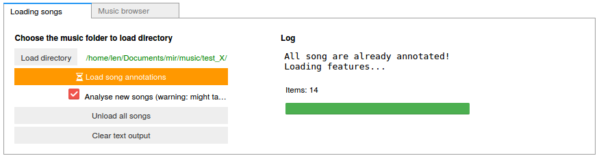
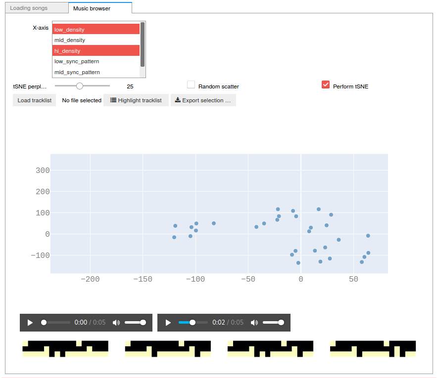

# Drum rhythm browser demo

This is a short and unfinished demo of a MIR tool to explore a drum'n'bass music library based on the rhythm in the music.

## How to use

Open `demo.ipynb`. Execute all the cells.

In the widget on the bottom, select a folder containing drum'n'bass music to analyze:

Enable the "Analyze new songs" checkmark and then click the orange "Load song annotations" button.

This will load the songs, annotate the beats, downbeats and structural boundaries in the music. It will also extract a beat-aligned drum audio extract from the drop of the music, then calculate an onset detection function (ODF) of the percussive instruments in that audio, and then quantize that ODF. This will then be used to browse through the rhythm in the music.

After the annotation is complete, you can go to the second tab. Select two features (by holding ctrl). This will show a scatter plot of the first feature you selected on the X axis, and the second on the Y axis. If you click one of the dots, it will plot the audio, the separated drum audio, and a visualization of the (estimated and quantized) drum pattern of four bars of music (top to bottom row: kick, snare, hihat).

This should allow you to find songs in your collection that have similar rhythmical properties. WIP, because many aspects of this demo are not finetuned yet (ODF extraction, quantization, rhythmical feature calculation, ...).  
I nevertheless hope that this is a useful starting point to build upon :)
